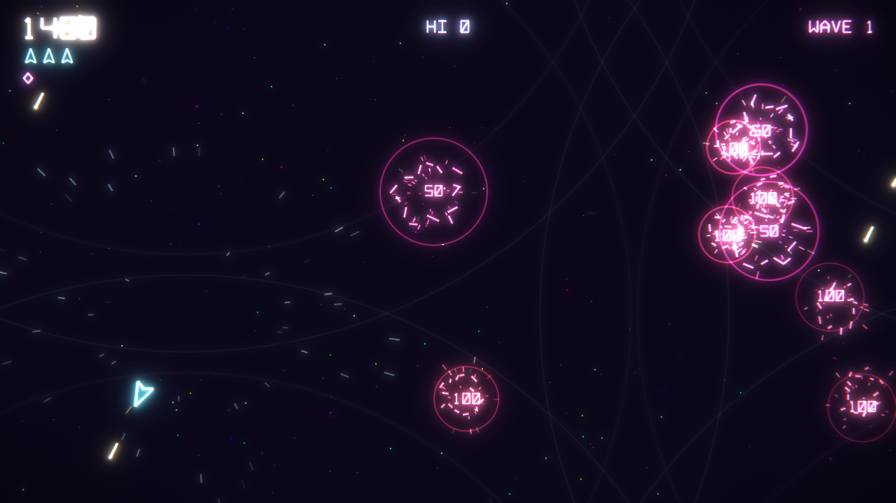

# Neon Asteroids

A modern take on vector Asteroids for [LÖVE](https://love2d.org/) 11.x: glowing neon vector graphics, a twinkling arcade starfield, heavy particle effects, Williams/Defender-style synthesized sound, and screen shake for the really big explosions. No image or audio assets — everything is drawn and synthesized in code.



## Running

```bash
love .
```

## Controls

| Action | Keyboard | Gamepad |
|--------|----------|---------|
| Rotate | ← → / A D | Left stick / D-pad |
| Thrust | ↑ / W | Right trigger / RB / D-pad up |
| Fire (hold for autofire) | Space | A |
| Hyperspace | ↓ / S / Shift | B |
| Smart bomb | B / X | X / Y |
| Pause (Q to quit while paused) | P / Esc | Start |
| Mute | M | |
| Fullscreen | F11 / Alt+Enter | |

## Gameplay

- Large asteroids (20) split into medium (50), which split into small (100).
- Flying saucers: the big one fires at random (200); the small one aims (1000) and turns up more as the score climbs.
- **Smart bomb** (Defender-style): a shockwave that destroys every medium and small asteroid and the saucer, and shatters large asteroids, flinging the pieces outward. You start with 2.
- An extra ship and an extra smart bomb every 10,000 points.
- The high score is saved in LÖVE's save folder (`neon-asteroids`).

## Learn to build it

[`tutorial/README.md`](tutorial/README.md) is a 21-chapter beginner tutorial that builds this game from scratch, starting from no Lua or LÖVE experience. Each chapter has a runnable checkpoint in `tutorial/`, for example `love tutorial/09-collisions`. There's also a web version of the same tutorial in `tutorial/learn-love.html`.

## Credits

`lib/starfield.lua` comes from [retro-starfield-starter-kit](https://github.com/pmirvine/retro-starfield-starter-kit) (MIT). The sound synthesis builds on that kit's `src/retro/sfx.lua`.
